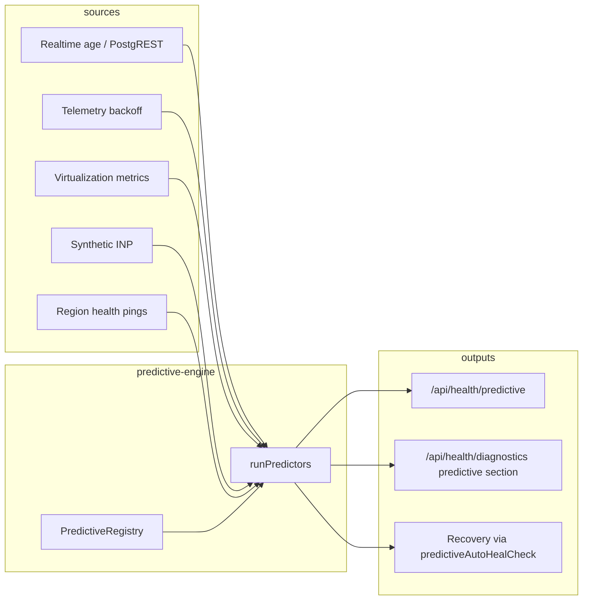

# Predictive diagnostics overview (Phase 53)

MyCardArchive runs a **predictive engine** alongside standard health checks. Predictors consume lightweight in-memory **sample rings** (last ~24 observations) and current subsystem snapshots to emit **early warnings** before hard failures.

## Architecture

## Predictor lifecycle

1. **`runPredictors()`** (with a short in-process cache for duplicate calls in one diagnostics pass) executes each registered predictor in registration order.
2. Each predictor returns **`PredictionResult`**: `name`, `ok`, **`severity`** (`info` | `warn` | `critical`), **`confidence`** (0–1), **`signal`** (short text), optional **`data`** (including **`sparkline`** arrays for UI), and **`ts`**.
3. Built-in predictors live in `src/lib/predictive/predictive-engine.ts` and register on module load.

## Severity and confidence

| Severity   | Meaning |
|-----------|---------|
| **info**  | Nominal or insufficient history; no action required. |
| **warn**  | Degrading trend or elevated metric — investigate before outage. |
| **critical** | Imminent or ongoing failure class — may trigger auto-heal when enabled. |

**Confidence** is a heuristic 0–1 score (not a statistical p-value). CI may treat **`warn` + confidence > 0.85** as a failing gate alongside **`critical`**.

Disable the engine with **`PREDICTIVE_MODE=0`** (see [predictive-env-vars.md](./predictive-env-vars.md)).
