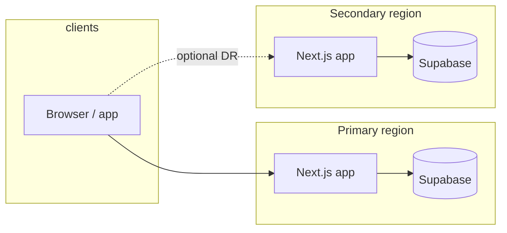

# Multi-region overview (Phase 51)

MyCardArchive can run with **logical region labels** (for example `us-east-1`, `eu-west-1`) paired with **region-specific Supabase project URLs** and **public site URLs** for health probes. This phase adds **routing hooks, health signals, and a controlled failover path** in code—it does **not** deploy multi-region infrastructure by itself.

## Architecture (high level)

- **Primary region**: Default production traffic; `PRIMARY_REGION` and `NEXT_PUBLIC_SUPABASE_URL` (and related keys).
- **Secondary region**: Standby or DR target; `SECONDARY_REGION`, `NEXT_PUBLIC_SUPABASE_URL_SECONDARY`, optional `NEXT_PUBLIC_SITE_URL_SECONDARY`.
- **Active region**: Logical “which region we are serving from” for diagnostics and failover; `ACTIVE_REGION` env plus optional in-memory override when `REGION_FAILOVER_ENABLED=1`.

## Health signals

Per region, the app probes:

1. **Supabase REST** — PostgREST root (`/rest/v1/`) with anon key.
2. **Auth / edge** — `GET /auth/v1/health` on the same Supabase host (proxy for “realtime-adjacent” edge health).
3. **Telemetry** — `GET /api/health/telemetry` on the region’s public site URL (`NEXT_PUBLIC_SITE_URL` or secondary).

Aggregated JSON is exposed at **`GET /api/health/region`**. **Active** logical region only: **`GET /api/health/region/active`**.

## Failover rules (code)

- Failover is **only** considered when **`REGION_FAILOVER_ENABLED=1`**.
- Automatic failover via recovery runs when **primary is unhealthy** (any of the three probes fail) **and** secondary is **configured and healthy**.
- **Failback** runs when **primary is healthy again** and the active region is still the secondary.
- Operations are **idempotent** (repeat calls do not double-apply state when already on the target region).

Durable cutover (DNS, Vercel regions, Supabase projects) still requires **deployment and operator steps**—see [failover-runbook.md](./failover-runbook.md).
